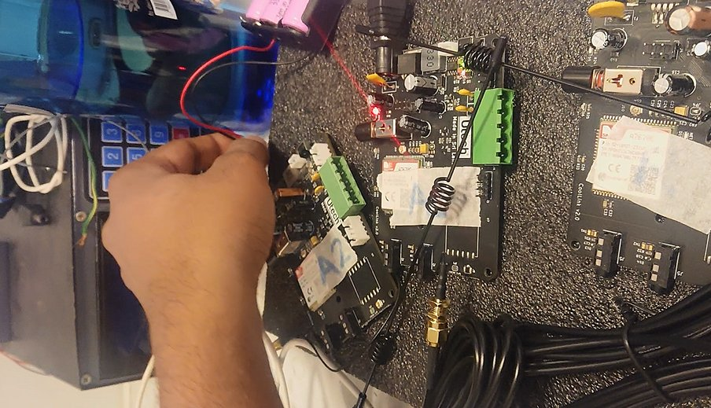
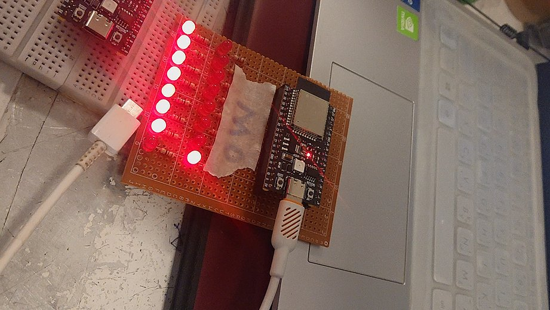

# ESP32 BLE Mesh Fire Alarm Monitoring System

A production-tested, distributed fire alarm monitoring system built on **ESP32** and **Bluetooth Low Energy Mesh** (Bluetooth Mesh 1.0, Espressif IDF stack).

Deployed in a factory with fire detectors at multiple locations. The security room and administrator room each have a dedicated **master node** displaying real-time alarm status and connectivity health of all 8 alarm zones on an indicator panel.

---

## Hardware Photos

<table>
<tr>
<td width="50%">

**Alarm Node — Bench Setup**



ESP32 alarm nodes wired up on the workbench during development. Visible: ESP32 boards labelled A1/A2, terminal blocks for alarm input wiring, SIM module board, and coil antenna. The red LED is active — alarm state is being detected and published over BLE Mesh.

</td>
<td width="50%">

**Master Node — Indicator Panel**



The master node perfboard with all 8 red alarm indicators illuminated during a full-system test (all alarm nodes reporting alarm state). The ESP32 module is soldered directly onto the perfboard. A second ESP32 (top left) is the second master node for the administrator room.

</td>
</tr>
</table>

---

---

## Table of Contents

1. [System Overview](#1-system-overview)
2. [Architecture Diagram](#2-architecture-diagram)
3. [Node Types](#3-node-types)
4. [BLE Mesh Vendor Model Design](#4-ble-mesh-vendor-model-design)
5. [Why Client Model on Master — No Server?](#5-why-client-model-on-master--no-server)
6. [Connectivity Monitoring — How It Works](#6-connectivity-monitoring--how-it-works)
7. [Message Protocol](#7-message-protocol)
8. [Layered Software Architecture](#8-layered-software-architecture)
9. [Provisioning with nRF Mesh App](#9-provisioning-with-nrf-mesh-app)
10. [Hardware Wiring](#10-hardware-wiring)
11. [Building and Flashing](#11-building-and-flashing)
12. [LED Behaviour Reference](#12-led-behaviour-reference)
13. [Directory Structure](#13-directory-structure)

---

## 1. System Overview

```
Factory Floor                          Security Room / Admin Room
─────────────────────────────          ──────────────────────────────
  [Alarm Node 1] ──┐                     ┌── [Master Node A]
  [Alarm Node 2] ──┤                     │     8× Red LEDs  (alarm state)
  [Alarm Node 3] ──┤  BLE Mesh           │     8× Green LEDs (connectivity)
  [Alarm Node 4] ──┼──────────────────►  │
  [Alarm Node 5] ──┤  Group Publish      └── [Master Node B]  (identical)
  [Alarm Node 6] ──┤  (every 2 s)
  [Alarm Node 7] ──┤
  [Alarm Node 8] ──┘
        ▲
  [Relay Node(s)] extend mesh range as needed
```

**Every alarm node publishes its status every 2 seconds.** Each master node independently receives these messages and updates its indicator panel. If the mesh connection to a node is lost, the green LED for that zone switches from blinking to solid ON (warning), while the red LED holds the **last known alarm state** — the system fails safe.

---

## 2. Architecture Diagram

```
┌──────────────────────────────────────────────────────────────────────┐
│                      BLE Mesh Network                                │
│                                                                      │
│  Group Address 0xC000 (example)                                      │
│  ┌─────────────┐   PUBLISH VND_OP_STATUS   ┌──────────────────────┐ │
│  │ Alarm Node  │ ─────────────────────────►│    Master Node       │ │
│  │  (SERVER    │   every 2 seconds          │    (CLIENT           │ │
│  │   model)    │   {node_index, alarm_state}│     model)           │ │
│  └─────────────┘                            │  SUBSCRIBEs to group │ │
│                                             └──────────────────────┘ │
│  ┌─────────────┐                                                      │
│  │ Relay Node  │  Rebroadcasts all mesh packets (relay=ENABLED)      │
│  │  (SERVER    │  Extends physical BLE range                         │
│  │   model)    │  Also subscribes to group for activity LED          │
│  └─────────────┘                                                      │
└──────────────────────────────────────────────────────────────────────┘
```

---

## 3. Node Types

| Node Type | Qty | Role | Model | Relay |
|-----------|-----|------|-------|-------|
| **Alarm Node** | 8 | Read fire detector → publish STATUS | Vendor SERVER (0x0001) | ✅ Enabled |
| **Master Node** | 2 | Receive STATUS → drive indicator panel | Vendor CLIENT (0x0000) | ❌ Disabled |
| **Relay Node** | As needed | Extend mesh range | Vendor SERVER (0x0001) | ✅ Enabled |

---

## 4. BLE Mesh Vendor Model Design

Bluetooth Mesh allows application-specific ("vendor") models identified by a **Company ID (CID)** and a **Model ID (MID)**. This project uses Espressif's development CID `0x02E5` with two model IDs:

| Model ID | Name | Used on |
|----------|------|---------|
| `0x0001` | Vendor SERVER | Alarm nodes, Relay nodes |
| `0x0000` | Vendor CLIENT | Master nodes |

### Opcodes

All opcodes are 3-byte vendor opcodes (`ESP_BLE_MESH_MODEL_OP_3`):

| Opcode | Name | Direction | Purpose |
|--------|------|-----------|---------|
| `0x00` | `VND_OP_SEND` | Alarm → Master | Generic (compatibility) |
| `0x01` | `VND_OP_STATUS` | Alarm → Group | **Primary: periodic alarm status** |
| `0x02` | `VND_OP_MASTER_PKT_SEND` | Master → Alarm (unicast) | Optional ping from master |
| `0x03` | `VND_OP_MASTER_PKT_STATUS` | Alarm → Master (unicast reply) | Echo reply to ping |
| `0x04` | `VND_OP_MASTER_PKT` | Master → Group | Optional group broadcast |

The critical opcode is **`VND_OP_STATUS` (0x01)** — this is the alarm heartbeat.

---

## 5. Why Client Model on Master — No Server?

This is one of the most important design decisions in the project.

### The Short Answer

> The master node **receives** published messages. It never holds alarm state. In Bluetooth Mesh, the node that **subscribes and receives** is the **Client**.

### The Long Answer

In Bluetooth Mesh, the Client/Server terminology describes the *role* of a model in a transaction:

- A **Server** model holds state (e.g. an alarm sensor's current value) and can both **publish** that state to a group and **respond** to GET/SET requests.
- A **Client** model **subscribes** to state changes. It initiates interactions with servers, but in a Publish/Subscribe pattern it simply **receives published messages**.

**Alarm nodes are Servers** because:
- They own the fire detector state (`alarm_state = 0 or 1`)
- They periodically **publish** that state to a group address
- They respond to optional unicast pings from the master

**Master nodes are Clients** because:
- They do not own any alarm state — they only **display** it
- They **subscribe** to the group address to receive published STATUS messages
- Using Model ID `0x0000` (CLIENT) on the master and `0x0001` (SERVER) on alarm nodes also keeps them visually distinct in the nRF Mesh app provisioner UI

**Why not also a Server model on the master?**

A Server model *can* receive messages, but its designed purpose is to hold and serve device state. Using a Server model on a pure subscriber would be semantically incorrect and would create confusion in the provisioner about what configuration is needed (publish address? subscription? both?).

The correct pattern from the Bluetooth Mesh specification is:

```
Alarm Node                                  Master Node
(Vendor SERVER 0x0001)                      (Vendor CLIENT 0x0000)
  publish addr = 0xC000  ────────────►   subscribe addr = 0xC000
```

**Why not use the built-in `esp_ble_mesh_client_t` struct?**

The ESP-IDF client model helper (`esp_ble_mesh_client_t`) is designed for request/response (GET→STATUS) transactions with timeout handling. In this system the alarm nodes **push** status unsolicited — there is no GET request. Receiving unsolicited published messages works perfectly with just the `MODEL_OPERATION_EVT` callback, without needing the client helper struct.

---

## 6. Connectivity Monitoring — How It Works

This is the other key design feature: **real-time connection health monitoring**.

### The Problem

A typical alarm display only shows the last alarm state. If a sensor node loses power or BLE connectivity, the display keeps showing "OK" — the security room has no way of knowing a detector is offline. For a fire alarm system this is unacceptable.

### The Solution

Every alarm node sends a STATUS message **every 2 seconds**, regardless of whether the alarm state changed. This acts as a **heartbeat**.

The master node tracks `last_seen_us[i]` — a microsecond timestamp updated every time a STATUS from node `i` is received.

A periodic heartbeat timer (every 200 ms) checks each node:

```
if (now - last_seen_us[i]) > NODE_TIMEOUT_US (4 seconds):
    green_mode[i] = SOLID_ON     // Node offline — WARNING
    // Red LED keeps last known alarm state (fail-safe!)
else:
    green_mode[i] = BLINK        // Node alive and reporting
```

### LED States Explained

| Green LED | Meaning |
|-----------|---------|
| OFF | Master not provisioned yet |
| SOLID ON | Node is NOT sending (connection lost or not yet heard) |
| BLINKING | Node is alive — STATUS received within last 4 seconds |

| Red LED | Meaning |
|---------|---------|
| OFF | No alarm from this node |
| ON | Alarm active on this node |
| ON (while green=SOLID) | **Last received alarm state was ALARM — node is now offline. Treat as alarm!** |

This fail-safe behaviour is critical: if a node loses connectivity while its alarm was active, the master **keeps the red LED on**. The security officer must physically investigate.

---

## 7. Message Protocol

### `alarm_status_msg_t` (2 bytes)

```c
typedef struct __attribute__((packed)) {
    uint8_t node_index;   // 0..7 — which alarm node sent this
    uint8_t alarm_state;  // 0 = OK, 1 = ALARM
} alarm_status_msg_t;
```

Published by each alarm node every `ALARM_STATUS_PERIOD_MS` (2000 ms) using opcode `VND_OP_STATUS`.

### Opcode Byte Format (3-byte vendor opcode)

```
[0xC0 | op_byte]  [CID_LSB = 0xE5]  [CID_MSB = 0x02]
```

For `VND_OP_STATUS` (op_byte = 0x01): `0xC1  0xE5  0x02`

---

## 8. Layered Software Architecture

Each firmware is structured into four layers. Dependencies flow downward only — upper layers call lower layers, never the reverse.

```
┌─────────────────────────────────────────────────────┐
│  Application Layer  (main.c)                        │
│  • app_main(), timer creation, ISR registration     │
│  • Orchestrates the other layers                    │
│  • Contains NO mesh or GPIO calls directly          │
├─────────────────────────────────────────────────────┤
│  Mesh / Transport Layer  (*_mesh.c / *_mesh.h)      │
│  • BLE Mesh stack init, model definitions           │
│  • Callback implementations                         │
│  • Message send/receive logic                       │
│  • Connectivity tracking state machine              │
├─────────────────────────────────────────────────────┤
│  HAL Layer  (*_hal.c / *_hal.h)                     │
│  • GPIO configuration (gpio_config)                 │
│  • Named read/write functions for each peripheral   │
│  • No application logic — pure hardware access      │
├─────────────────────────────────────────────────────┤
│  Configuration Layer  (*_config.h)                  │
│  • GPIO pin numbers                                 │
│  • Timing constants                                 │
│  • Node identity (ALARM_NODE_INDEX)                 │
│  + mesh_config.h: opcodes, CID, shared struct       │
└─────────────────────────────────────────────────────┘
```

### File Map

#### Alarm Node

| File | Layer | Responsibility |
|------|-------|----------------|
| `mesh_config.h` | Protocol | Opcodes, CID, `alarm_status_msg_t`, `MAX_ALARM_NODES` |
| `alarm_node_config.h` | Config | GPIO pins, timing, `ALARM_NODE_INDEX` |
| `alarm_node_hal.h/.c` | HAL | `alarm_hal_gpio_init()`, `alarm_hal_read_alarm_state()`, LED control |
| `alarm_node_mesh.h/.c` | Mesh | BLE Mesh init, publish STATUS, provisioning callbacks |
| `main.c` | Application | `app_main()`, status timer, green-blink timer, reset ISR |

#### Master Node

| File | Layer | Responsibility |
|------|-------|----------------|
| `mesh_config.h` | Protocol | Shared with alarm node |
| `master_node_config.h` | Config | LED GPIO arrays, timeout values |
| `master_node_hal.h/.c` | HAL | 16-LED GPIO init, per-node LED set functions |
| `master_node_mesh.h/.c` | Mesh | Vendor CLIENT model, STATUS receive, heartbeat FSM |
| `main.c` | Application | `app_main()`, heartbeat timer, reset-poll timer |

#### Relay Node

| File | Layer | Responsibility |
|------|-------|----------------|
| `mesh_config.h` | Protocol | Shared with alarm node |
| `relay_node_config.h` | Config | Single LED pin, timing |
| `relay_node_hal.h/.c` | HAL | LED + reset button GPIO |
| `relay_node_mesh.h/.c` | Mesh | BLE Mesh init, activity tracking, reset poll |
| `main.c` | Application | `app_main()`, LED FSM timer, reset-poll timer |

---

## 9. Provisioning with nRF Mesh App

All nodes are provisioned using the **nRF Mesh** app (Android / iOS). No custom provisioner firmware is needed — this is by design.

### Steps

1. Flash all nodes.
2. Open nRF Mesh app → **Scan** → identify each device by its UUID prefix `{0x32, 0x10, <MAC...>}`.
3. **Provision** each node. Give each a human-readable name (e.g. `AlarmNode-01`, `Master-Security`).
4. For each node, add an **AppKey** and **bind** it to the vendor model.
5. For each **alarm node** (SERVER model 0x0001):
   - Set **Publish address** to the group address (e.g. `0xC000`) with `VND_OP_STATUS`.
6. For each **master node** (CLIENT model 0x0000):
   - Set **Subscribe address** to the same group address `0xC000`.
7. For each **relay node** (SERVER model 0x0001):
   - Set **Subscribe address** to `0xC000` (needed for the activity LED).
8. Done. Alarm nodes will start publishing; master nodes will start receiving.

### Why the alarm node sends regardless of provisioner-set subscription

The alarm node uses `esp_ble_mesh_model_publish()` which uses the **publish address** configured via the Config Server (by nRF Mesh app). There is no hard-coded address in firmware — the provisioner controls the mesh topology entirely.

---

## 10. Hardware Wiring

### Alarm Node

| Pin | Function |
|-----|----------|
| GPIO 12 | Fire detector digital input (active HIGH, pull-up) |
| GPIO 25 | Red LED (alarm state indicator) |
| GPIO 23 | Green LED (heartbeat / publish indicator) |
| GPIO 0  | Reset button (active LOW, pull-up, BOOT button on DevKit) |

> Change pins in `alarm-node/main/alarm_node_config.h`

### Master Node (one panel)

| Pins | Function |
|------|----------|
| GPIO 12, 13, 14, 15, 16, 17, 18, 19 | Red LEDs — alarm nodes 1–8 |
| GPIO 21, 22, 23, 25, 26, 27, 32, 33 | Green LEDs — connectivity nodes 1–8 |
| GPIO 0 | Reset button |

> Change pins in `master-node/main/master_node_config.h`

### Relay Node

| Pin | Function |
|-----|----------|
| GPIO 25 | Green LED (relay activity indicator) |
| GPIO 0  | Reset button |

> Change pins in `relay-node/main/relay_node_config.h`

---

## 11. Building and Flashing

Requires **ESP-IDF v5.x** with BLE Mesh component enabled.

### Alarm Node

```bash
cd alarm-node

# Set the unique index for this board (0..7):
idf.py build -DALARM_NODE_INDEX=0   # Node 1
idf.py build -DALARM_NODE_INDEX=1   # Node 2
# ... etc.

idf.py -p /dev/ttyUSB0 flash monitor
```

> Each of the 8 alarm nodes must be flashed with a different `ALARM_NODE_INDEX`.
> Alternatively, set `CONFIG_ALARM_NODE_INDEX` in `Kconfig.projbuild`.

### Master Node

```bash
cd master-node
idf.py build
idf.py -p /dev/ttyUSB0 flash monitor
```

Both master nodes flash identically — no per-device configuration needed.

### Relay Node

```bash
cd relay-node
idf.py build
idf.py -p /dev/ttyUSB0 flash monitor
```

---

## 12. LED Behaviour Reference

### Alarm Node

| LED | Before Provisioning | After Provisioning |
|-----|--------------------|--------------------|
| Red | OFF | Mirrors live alarm input |
| Green | OFF | Brief 300 ms blink every 2 s on each publish |

### Master Node

| LED | Before Provisioning | Provisioned, No Data | Receiving Data | Node Timed Out |
|-----|--------------------|--------------------|----------------|----------------|
| Green[i] | OFF | SOLID ON | BLINKING | SOLID ON |
| Red[i] | OFF | OFF | Mirrors alarm_state | **Last received state** |

### Relay Node

| LED | Before Provisioning | Provisioned, No Traffic | Traffic Active |
|-----|--------------------|-----------------------|----------------|
| Green | OFF | OFF | BLINK → SOLID ON |

---

## 13. Directory Structure

```
esp32-ble-mesh-fire-alarm-monitoring-system/
│
├── alarm-node/                  # Alarm sensor node firmware
│   ├── main/
│   │   ├── mesh_config.h        # Protocol: opcodes, CID, alarm_status_msg_t
│   │   ├── alarm_node_config.h  # Config: GPIO pins, timing, ALARM_NODE_INDEX
│   │   ├── alarm_node_hal.h/.c  # HAL: GPIO abstraction
│   │   ├── alarm_node_mesh.h/.c # Mesh layer: BLE Mesh init + publish
│   │   ├── main.c               # Application: timers, ISR, app_main
│   │   └── CMakeLists.txt
│   ├── CMakeLists.txt
│   ├── sdkconfig.defaults
│   └── Makefile
│
├── master-node/                 # Monitoring / indicator panel firmware
│   ├── main/
│   │   ├── mesh_config.h        # Protocol (same as alarm-node)
│   │   ├── master_node_config.h # Config: LED GPIO arrays, timeouts
│   │   ├── master_node_hal.h/.c # HAL: 16-LED + reset button GPIO
│   │   ├── master_node_mesh.h/.c# Mesh layer: STATUS receive, heartbeat FSM
│   │   ├── main.c               # Application: timers, app_main
│   │   └── CMakeLists.txt
│   ├── CMakeLists.txt
│   ├── sdkconfig.defaults
│   └── Makefile
│
├── relay-node/                  # Range-extension relay firmware
│   ├── main/
│   │   ├── mesh_config.h        # Protocol (same as alarm-node)
│   │   ├── relay_node_config.h  # Config: LED pin, timing
│   │   ├── relay_node_hal.h/.c  # HAL: LED + reset button GPIO
│   │   ├── relay_node_mesh.h/.c # Mesh layer: init, activity tracking
│   │   ├── main.c               # Application: LED FSM, app_main
│   │   └── CMakeLists.txt
│   ├── CMakeLists.txt
│   ├── sdkconfig.defaults
│   └── Makefile
│
├── docs/                        # Additional documentation (see below)
├── .gitignore
└── LICENSE
```

---

## Notes

- This project is based on the ESP-IDF `bluetooth/esp_ble_mesh/vendor_models/vendor_client` example, adapted and extended for a real production use case.
- The `ble_mesh_example_init` component (providing `bluetooth_init()` and `ble_mesh_get_dev_uuid()`) is from the ESP-IDF examples. It must be present in the component path when building.
- BLE Mesh provisioning data (network keys, AppKeys, publish/subscribe addresses) is stored in NVS. A 5-second button press on GPIO 0 calls `esp_ble_mesh_node_local_reset()` to wipe this and allow re-provisioning.

---

## License

Apache-2.0 — see [LICENSE](LICENSE).
